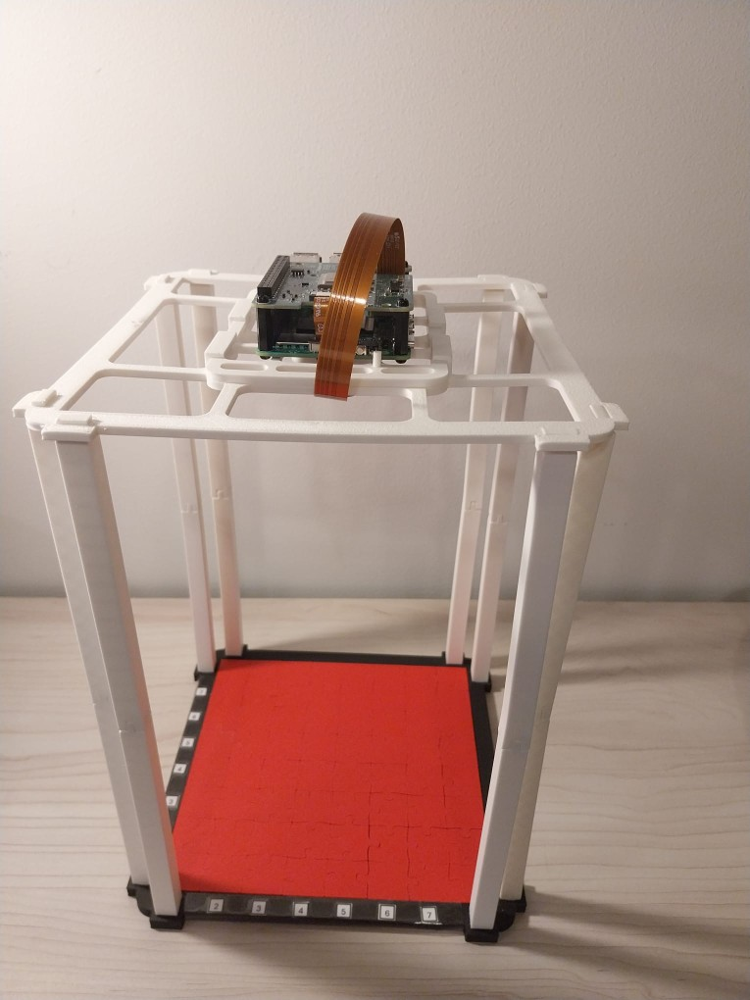
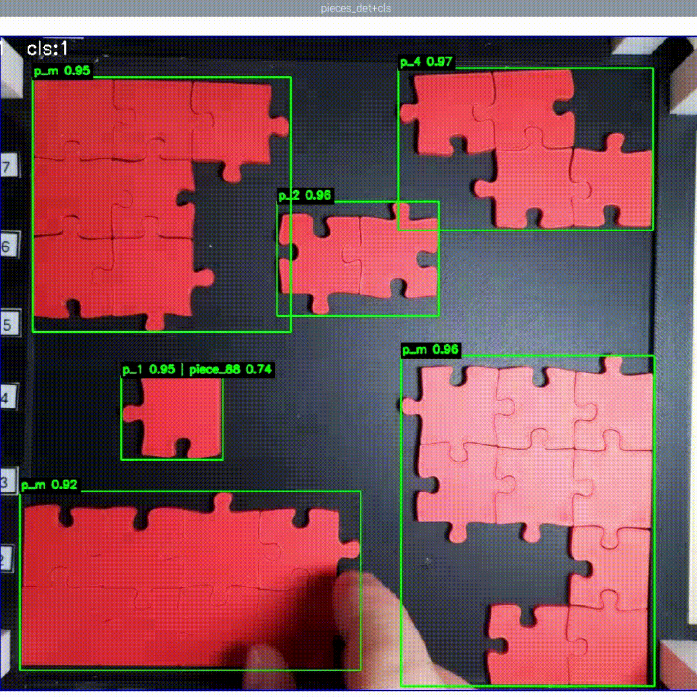
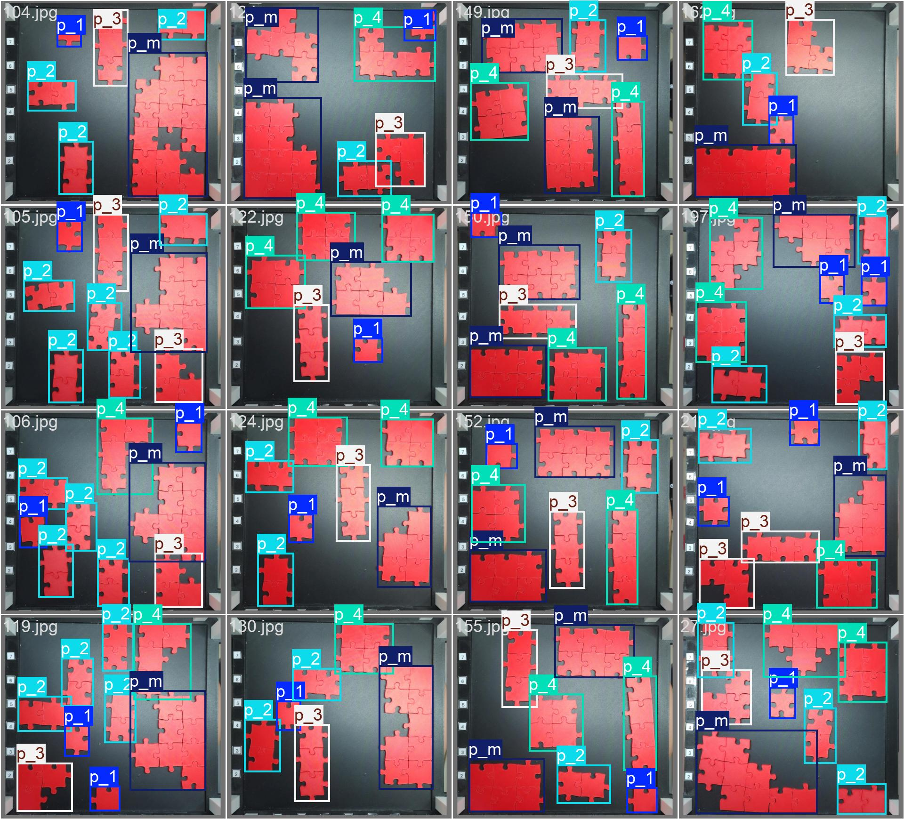
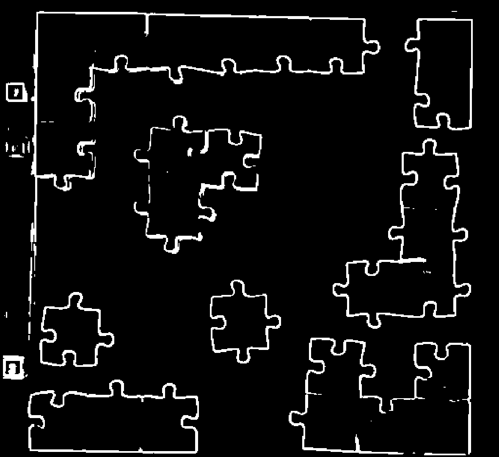
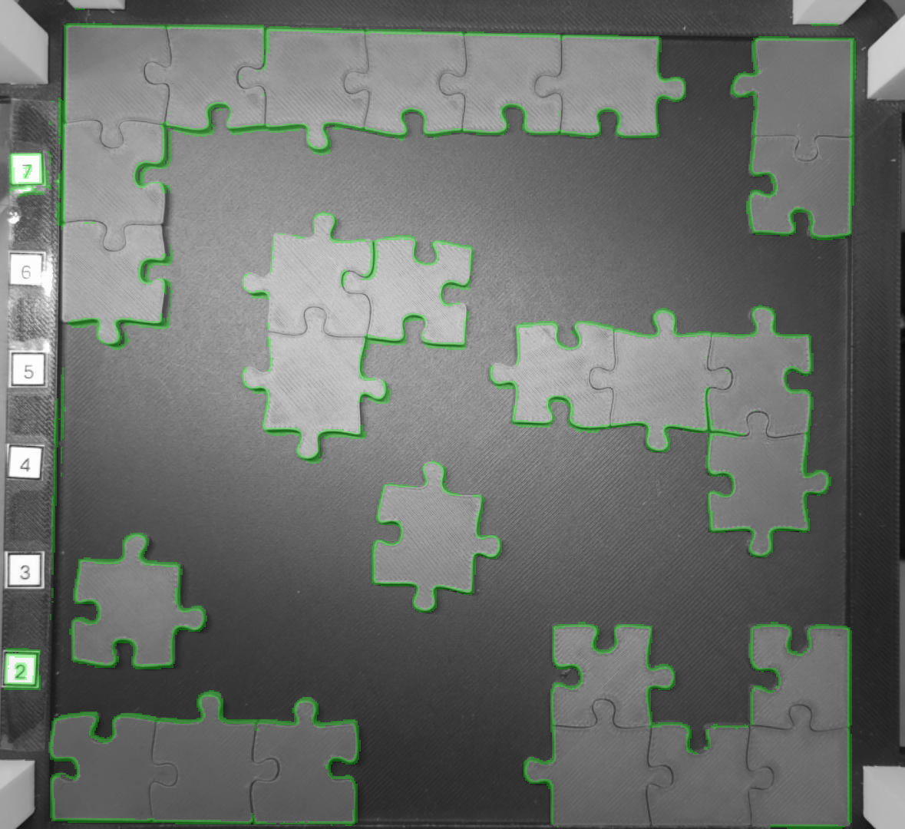

# 🧩 Project PuzzleVision Pipeline

**Team members:** Nikita Mickevics, Anastasija Zubkova, Ismayil Aliyev, Maksims Dorozko

**Submission:** Portfolio / repository-based submission

**Project in one sentence:** We built a compact puzzle-piece perception pipeline that detects and localizes pieces with YOLO, and learns edge/mask representations with a lightweight grayscale U-Net to support downstream edge characterization. The system is structured to be deployable in a Pi-ready workflow and to enable future comparison of stable parametric jigsaw-edge descriptions.

---

## Overview

This repository contains an end-to-end **puzzle-piece perception** pipeline, spanning dataset preparation, training, and deployment:

- **CNN (grayscale U-Net)** for edge/mask prediction (training + inference) to support robust edge extraction.
- **YOLO multi-piece detection (Ultralytics)** for dataset building and detection training.
- **Single-piece classifier** trained with `timm` backbones (namely **MobileNetV3**) for per-piece classification.
- **Deployment:** the multi-piece detector and single-piece classifier run as **live inference** on a **Raspberry Pi 5** equipped with a **26-TOPS AI HAT**.




> **3D Prints**  
> The Raspberry Pi mount was custom designed by **Nikita** and **Ismail** in **[Onshape](https://www.onshape.com/)**. The corresponding 3D model files are included in the repository (see [`3d_models/`](3d_models/)).

### Raspberry Pi live inference (Pi 5 + 26-TOPS AI HAT)

> Runs the **multi-piece detector** and **single-piece classifier** as a **live camera pipeline** on Raspberry Pi using **Picamera2** + **HailoRT** (26-TOPS AI HAT).

**Technical goal (detector)**
- The detector’s job is to perform **real-time multi-object detection**: find **all puzzle pieces in the camera frame**, outputting **bounding boxes + confidence scores + coarse piece categories**.
- This output enables downstream steps: **cropping** each detected piece for classification, tracking/selection logic, and providing stable ROI candidates for later edge/shape analysis.

**Detector classes**
- `0: p_1`
- `1: p_2`
- `2: p_3`
- `3: p_4`
- `4: p_m`

**On-device artifacts**
- **Detector:** `pieces_det.hef` (compiled YOLO multi-piece detector)
- **Classifier:** `piece_cls.hef` (compiled MobileNetV3 classifier)
- **Class names:** `classes.txt`

**Hailo optimisation & conversion (high level)**
1. Export trained models to **ONNX**.
2. Use Hailo tooling to **calibrate/quantize** with a representative calibration set.
3. **Compile** the optimised models into **`.hef`** for execution on the AI HAT.

**Live inference script (repo root)**
- [`run_pi_main.py`](run_pi_main.py) *(update the filename/link if your script name differs)*
- Captures frames at **1920×1080**, applies an ROI crop + letterbox resize, runs YOLO detection, then (optionally) classifies the top detections (e.g., only YOLO class `p_1`).
- Keyboard controls: press **`q`/`Esc`** to quit, **`s`** to save debug frames and classifier inputs (default: `~/Desktop/hailo_debug/`).

```bash
# On Raspberry Pi (from repo root)
python hailo_live_inference.py
```
---

**Demo media**





---

### CNN U-Net training & inference (grayscale edge/mask model)

> Trains and runs a lightweight **single-channel U-Net** that predicts **edge/mask maps** from grayscale puzzle images.  
> The model is trained on the auto-generated mask targets in `cnn_train_dataset/` and saved as a PyTorch `.pth` checkpoint.

**Technical goal (CNN)**
- Learn a **compact, stable pixel-level representation** of puzzle-piece boundaries by predicting a **binary edge/mask** from grayscale input.
- Provide cleaner edge candidates for downstream processing (e.g., contour extraction / curve fitting) and robust preprocessing under varying lighting.

**Data format (expected by `PuzzleEdgesDatasetGray`)**
- Images: `cnn_train_dataset/{train,val}/images_bw/*.png`
- Masks:  `cnn_train_dataset/{train,val}/masks/<same_stem>.png`
- Inputs are resized to **512×512** via `BasicGrayTransform`.

**Training script behaviour (what it does)**
- Loads `PuzzleEdgesDatasetGray` for `train` and `val`.
- Trains `UNetGray(in_channels=1, out_channels=1)` with:
  - Loss: `BCEWithLogitsLoss`
  - Optimizer: `Adam`
- Tracks validation loss and **saves the best checkpoint** to `--out-model`.

---

**Demo media**





---

## Team responsibilities & workload

| Team member | Contribution | Responsibilities |
|---|---:|---|
| **Nikita** | **30%** | Hardware integration and Raspberry Pi setup; YOLO-based **classification models** and deployment support for the classification pipeline. |
| **Anastasija** | **30%** | CNN pipeline for edge/mask detection (**grayscale U-Net**) including dataset preparation and training; handled **organisation/agile process** (planning, coordination, task tracking). |
| **Ismail** | **20%** | **Hailo optimisation + conversion** workflow (quantisation/calibration, `.hef` compilation) and deployment troubleshooting on Raspberry Pi; designed/managed **3D models / prints** for the Pi mount and related hardware parts. |
| **Maxims** | **20%** | YOLO detection **model architecture** decisions and early R&D: experiments, baselines, and initial training iterations that shaped the final detector pipeline. |


> Percentages reflect estimated overall contribution to the project deliverables (total = 100%).

---

## Annotated table of contents (links to all submission items)

> Each row includes **title**, **short description**, and **contributor(s)**.

| Link                                                               | Title                                | Short description                                                                                                                                                                                          | Contributor(s)              |                         |      |
| ------------------------------------------------------------------ | ------------------------------------ | ---------------------------------------------------------------------------------------------------------------------------------------------------------------------------------------------------------- | --------------------------- | ----------------------- | ---- |
| [README_CNN.md](README_CNN.md) | CNN README — U-Net setup & workflow | Step-by-step instructions (run from `cnn/`) to install dependencies, prepare data from `../multi_piece_dataset/` (split → auto-generate edge masks → convert to grayscale), optionally train `UNetGray`, and run predictions with overlay.                                            | Anastasija                        |                         |      |
| [SUBMISSION_README.md](SUBMISSION_README.md)                       | Portfolio & overview document | Portfolio-style overview of the submission: team + project summary, annotated table of contents (with contributions), repository map, how-to-run guides for each pipeline, expected outputs, and grading/rubric note.                                                                                                                      | Team	                        |                         |      |
| [main_train_multi_piece_model.py](main_train_multi_piece_model.py) | Multi-piece YOLO dataset + training driver | End-to-end script that (1) draws optional XML debug overlays, (2) generates YOLO `.txt` labels and updates `yolo_classes.json`, (3) crops images and updates XML annotations, (4) builds a YOLO-format dataset in `multi_piece_train/` (images/labels + `data.yaml`), and (5) launches Ultralytics YOLO **detect/train** via the local venv `yolo` executable (e.g., `yolo11s.pt`, imgsz=640, epochs=200). | Nikita (70%) Maksims (30%) |                        
| [cnn/](cnn/) | CNN (U-Net) edge-mask pipeline | Self-contained grayscale U-Net workflow for edge/mask learning: train/val dataset creation (`split_images.py` → `cnn_train_dataset/`), automatic mask generation (`auto_generate_masks.py`), grayscale preprocessing (`preprocess_to_bw.py`), model definition (`unet_gray.py`) + dataset loader (`dataset_puzzle_gray.py`), training (`train_unet_gray.py` → `models_cnn/`), and inference (`predict_unet_gray.py` → `predictions/`).                                                                                                                             | Anastasija                        |                         |      |
| [cnn/split_images.py](cnn/split_images.py)                         | CNN dataset split                    | Splits `../multi_piece_dataset/*.jpg` into `cnn_train_dataset/train/images` and `cnn_train_dataset/val/images` (default 80/20).                                                                            | Anastasija                      |                         |      |
| [cnn/auto_generate_masks.py](cnn/auto_generate_masks.py)           | Mask generator                       | Creates CNN masks using bilateral filtering → Otsu segmentation → Canny → skeletonize → CC filtering → dilate. Key knob: `MIN_SKELETON_LEN`.                                                               | Anastasija |                         |      |
| [cnn/preprocess_to_bw.py](cnn/preprocess_to_bw.py)                 | Grayscale preprocessing              | Converts images to grayscale PNGs in `images_bw/`.                                                                                                                                                         | Anastasija                      |                         |      |
| [cnn/train_unet_gray.py](cnn/train_unet_gray.py)                   | Train U‑Net                          | Trains `UNetGray` on `PuzzleEdgesDatasetGray`, saves best model on validation loss improvement.                                                                                                            | Anastasija                      |                         |      |
| [cnn/predict_unet_gray.py](cnn/predict_unet_gray.py)               | Predict U‑Net masks                  | Runs inference for saved model weights and writes predictions (optionally overlays).                                                                                                                       | Anastasija                      |                         |      |
| [scr/multi_piece_model/](scr/multi_piece_model/)                   | Multi-piece utilities                | Debug overlays, XML→YOLO conversion, cropping heuristics, YOLO dataset builder/splitter (`split_dataset_for_yolo.py`).                                                                                     | Nikita                        |                         |      |
| [scr/single_piece_model/](scr/single_piece_model/)                 | Single-piece classifier              | Trains classifier using `timm` (default `mobilenetv3_small_100`), saves best checkpoint and exports ONNX.                                                                                                  | Nikita |                         |      |
| [multi_piece_dataset/](multi_piece_dataset/)                       | Multi-piece raw dataset              | Raw multi-piece images with Pascal VOC XML and/or YOLO TXT labels (keep pairings consistent).                                                                                                              | Nikita                        |                         |      |
| [multi_piece_train/](multi_piece_train/)                           | YOLO dataset output                  | Auto-generated YOLO structure: images/train  val, labels/train          val`, plus `data.yaml`. | Maksims (60%) Ismail (40%)  |
| [single_piece_dataset/](single_piece_dataset/)                     | Single-piece dataset                 | ImageFolder layout for classifier training (`train/<class>/...`, `val/<class>/...`).                                                                                                                       | Maksims                        |                         |      |
| [runs_yolo/](runs_yolo/)                                           | YOLO experiment outputs              | Ultralytics detection training runs (e.g., `detect/train`) with `args.yaml` referencing dataset YAML.                                                                                                      | Maksims                        |                         |      |
| [runs_mobilenetv3/](runs_mobilenetv3/)                             | Classifier experiment outputs        | Checkpoints (`best.pth`), exported ONNX, and class lists.                                                                                                                                                  | Maksims                        |                         |      |
| [3d_models/](3d_models/)                                           | 3D hardware models                   | STL CAD files used for physical mounts/fixtures (hardware integration; not part of ML training pipeline).                                                                                                  | Nikita (50%) Ismail (50%)              |                         |      |
| [.github/](.github/)                                               | CI files.                                                                                                                                                | team                        |                         |      |

---

### Key folders

* `cnn/` — Grayscale U‑Net training & inference pipeline (run scripts from `cnn/`).
* `scr/` — Dataset preparation and experiment utilities.
* `multi_piece_dataset/` — Raw multi-piece data and labels.
* `multi_piece_train/` — Generated YOLO dataset output.
* `single_piece_dataset/` — ImageFolder dataset for single-piece classifier.
* `runs_yolo/`, `runs_mobilenetv3/` — Training outputs.
* `3d_models/` — Hardware integration STL files.

---

### 1) Environment setup

> Use a virtual environment. Ensure **Ultralytics (`yolo` CLI)** is installed in the **same venv** used to run Python.

```bash
# From repo root
python -m venv .venv
# Windows:
#   .venv\Scripts\activate
# macOS/Linux:
#   source .venv/bin/activate

pip install -U pip
pip install -r requirements.txt
```

---

### 2) CNN U-Net edge/mask pipeline (run from `cnn/`)

> CNN utilities assume the current working directory is `cnn/`.  
> For additional details and troubleshooting, see **[README_CNN.md](README_CNN.md)**.

```bash
cd cnn

# A) Split raw images into train/val for CNN
python split_images.py

# B) Auto-generate masks
python auto_generate_masks.py \
  --data-dir cnn_train_dataset \
  --image-folder images \
  --splits train val \
  --overwrite

# C) Convert images to grayscale PNGs
python preprocess_to_bw.py

# D) Train U-Net
python train_unet_gray.py \
  --data-dir cnn_train_dataset \
  --out-model models_cnn/unet_puzzle_gray.pth \
  --epochs 30 \
  --batch-size 4 \
  --lr 1e-3

# E) Predict masks (example: on validation set)
python predict_unet_gray.py \
  --model models_cnn/unet_puzzle_gray.pth \
  --input-dir cnn_train_dataset/val/images_bw \
  --out-dir predictions \
  --overlay
```

---

### 3) Multi-piece YOLO detection training (run from repo root)

> Builds YOLO dataset and runs Ultralytics training.

```bash
# From repo root
python main_train_multi_piece_model.py
```

**Notes**

* The script generates debug images, creates YOLO `.txt` labels, crops images, builds `multi_piece_train/`, and runs `yolo detect train`.
* `YoloDatasetBuilder` uses `.txt` labels as source-of-truth — missing image/label pairs may be skipped or raise errors.

---

### 4) Single-piece classifier training (run from repo root)

```bash
python scr/single_piece_model/train_piece_classifier.py \
  --data-dir single_piece_dataset \
  --model mobilenetv3_small_100
```

Outputs are typically written under `runs_mobilenetv3/` (e.g., `best.pth` + exported `.onnx`).

---

## Expected outputs

* **U‑Net weights:** `cnn/models_cnn/unet_puzzle_gray.pth` (or `--out-model` path)
* **U‑Net predictions:** `cnn/predictions/` (or `--out-dir`)
* **YOLO dataset:** `multi_piece_train/` (plus `data.yaml`)
* **YOLO runs:** `runs_yolo/`
* **Classifier runs:** `runs_mobilenetv3/` (checkpoints + ONNX)

---

## Troubleshooting

* **Missing masks / dataset errors**

  * Ensure masks exist under `cnn_train_dataset/{train,val}/masks` and match image stems.
* **`yolo` command not found**

  * Activate the venv and confirm `pip show ultralytics` works.
* **Images not found by CNN scripts**

  * Confirm you are running from the `cnn/` directory.

---

## Credits

* Core ML libraries: PyTorch (`torch`, `torchvision`), Ultralytics (`ultralytics`), `timm`, OpenCV, scikit-image, PIL.
* Deployment stack: Raspberry Pi 5 + Picamera2/libcamera, and Hailo (HailoRT / Hailo platform tools) for model optimisation, compilation (`.hef`), and on-device inference.
